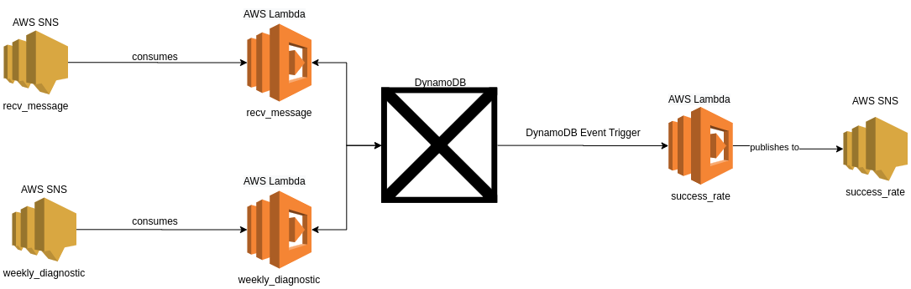

# bookish-guacamole

# Overview
TODO

# Service Requirements
## Assumptions 
  * Batch based off weekly events
  * Success rate is calculated across all time. 

## Event schema

### Received Message Event
Payload: 
```
 {
  "moduleId": <string>,
  "timestamp": <uint64_t>
 }
```
Where: 
 * `moduleId`: is the unique identifier of a module. 
 * `tx_attempts`: is the cumulative count since the module was reset
Generated for every message received, successfully, from an IoT device. 
SNSTopic Name: `recv_message`

### Weekly Message Event 
```
 {
   “moduleid”: <string>,
   “timestamp”: <uint64_t>,
   “attempts”: <uint32_t>
 }
```
Where:
 * `moduleid`: unique identifier of a module
 * `timestamp`: a unix timestamp (1/1/1970)
 * `attempts`: the cumulative count of attempted message transmissions since the module was reset
Generated on a time scheduled basis, weekly. 
SNSTopic Name: `weekly_diagnostic`

### Success Rate Event
```
 {
   “moduleid”: <string>,
   “timestamp”: <uint64_t>,
   “success_rate”: <float>
 }
```
Where:
 * `moduleid`: unique identifier of a module
 * `timestamp`: a unix timestamp (1/1/1970)
 * `success_rate`: the percentage attempted message transmissions which have been successfully received

Generated on an update to the table ``, within the DynamoDB. See [DynamoDB Schema](#dynamodb-schema).
SNSTopic Name: `success_rate`
 

# Solution Documentation
## Architecture

  The above diagram outlines the design for the service. Amazon SNS is used as the messaging service within the event-driven architecture. AWS Lambdas are used as the underlying compute for the service, and are both consumers and produces of messages from the various events (see above for event schema and naming). DynamoDB is used as a mock data lake (for need of rapid development) for the service. This choice is for two reasons: namely the prior mentioned rapid development, and DynamoDB's event triggers. 

The Success Rate microservice listens for updates from the table ``, whereby weekly diagnostic data is stored (see [below](design-considerations) for rationale). 

## DynamoDB Schema 

Table: `message_recv`
  Primary Key (composite): 
    * Partition Key: `moduleId`
    * Sort Key: `timestamp`
  
  Attributes:
    * `moduleId`: string, S
    * `timestamp`: int, N

Table: `weekly_diagnostic`
   Primary Key (composite): 
    * Partition Key: `moduleId`
    * Sort Key: `timestamp`
  
  Attributes:
    * `moduleId`: string, S
    * `timestamp`: int, N
    * `attempts`: int, N


## Design Considerations
 * The decision to trigger the success rate based off the weekly diagnostic is for two reasons (and for lack of strict requirement). Firstly, more frequent updates will be incorrect and/or require data remediation. Consider `message_recv` events for a module with a timestamp after the module's most recent `weekly_diagnostic`. Aggregating such successful messages will bias the success rate (hence incorrect), and depending on the use of the `success_rate` events, other microservices will require data remediation (once a new `weekly_diagnostic` for the module arrives). 
 * DynamoDB is not a suitable for a full analytics system. It is intended as a mock datastore for the remaining decisions about the service. 
 * Except to create tables easily queriable by moduleID (the current main use case), little schema design has been considered.
